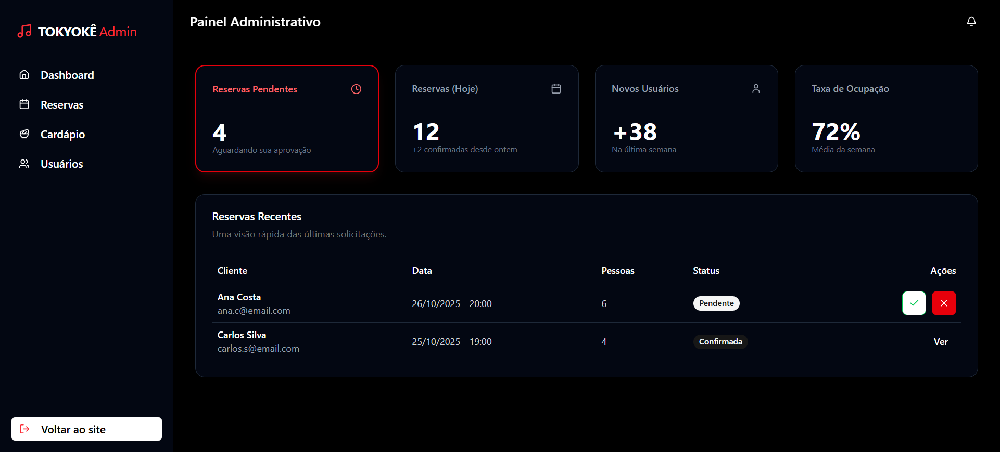
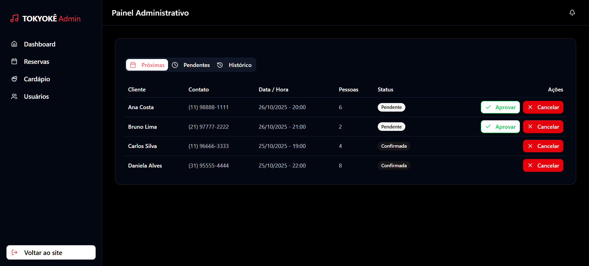
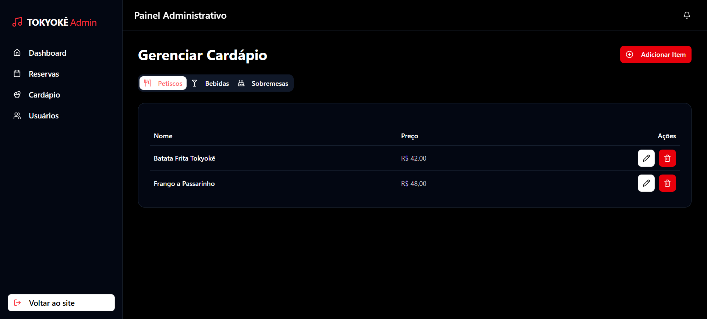

# Design do Painel Administrativo

Este documento detalha o design estético e a funcionalidade das páginas que compõem o painel administrativo do projeto. O objetivo é fornecer uma visão clara sobre a interface do usuário, a experiência de navegação e as escolhas de design que suportam as operações de gerenciamento.

## Visão Geral do Design

O painel administrativo adota um tema escuro predominantemente, utilizando uma paleta de cores sóbria que favorece a legibilidade e reduz a fadiga ocular, especialmente em ambientes de uso prolongado. A interface é limpa e intuitiva, com foco na usabilidade e eficiência para o usuário administrador.

### Paleta de Cores e Tipografia

*   **Fundo:** Preto (#000000) e azul escuro quase preto (#1A1A2E) para as seções de conteúdo, criando contraste e profundidade.
*   **Texto:** Branco (#FFFFFF) e cinza claro para o texto principal, garantindo alta legibilidade.
*   **Elementos Interativos/Destaque:** Vermelho vibrante (#FF0000) é usado para botões de ação críticos (e.g., "Adicionar Item", "Salvar", "Cancelar", ícones de exclusão) e para indicar status importantes (e.g., "Reservas Pendentes", "Bloqueado"). Verde é usado para status positivos (e.g., "Ativo", "Aprovar", "Confirmada").
*   **Tipografia:** Uma fonte moderna e sem serifa é empregada em todo o painel para clareza e uma estética contemporânea.

### Estrutura e Layout

O layout geral é dividido em duas seções principais:

1.  **Barra de Navegação Lateral (Sidebar):** Localizada à esquerda, em um tom de azul escuro, contém os links principais para as diferentes seções do painel. É persistente em todas as páginas, facilitando a navegação.
2.  **Área de Conteúdo Principal:** Ocupa a maior parte da tela, apresentando o conteúdo específico da seção selecionada.

## Páginas Detalhadas

### 1. Dashboard (Visão Geral)

A página do Dashboard serve como o ponto de entrada principal do administrador, oferecendo uma visão consolidada e rápida das informações mais críticas do sistema.

*   **Propósito:** Fornecer um resumo executivo das métricas importantes, como número de reservas pendentes e confirmadas, novos usuários e taxa de ocupação.
*   **Estética:** Utiliza cartões de informação com ícones e cores distintas para chamar a atenção para dados importantes. "Reservas Pendentes" é destacado em vermelho, indicando a necessidade de atenção imediata.
*   **Funcionalidade:** Exibe uma lista de "Reservas Recentes" com status visualmente claros (Pendentes em laranja, Confirmadas em verde), permitindo ações rápidas de aprovação ou rejeição diretamente nesta tela.

### 2. Gerenciar Reservas

Esta seção permite ao administrador visualizar e gerenciar todas as reservas.

*   **Propósito:** Centralizar o controle sobre as solicitações de reserva, permitindo aprovar, cancelar e revisar o histórico.
*   **Estética:** Organizada em abas ("Próximas", "Pendentes", "Histórico") para facilitar a filtragem. As informações são apresentadas em formato de tabela, com linhas alternadas em tons de cinza escuro para melhor legibilidade. Status de reserva são coloridos (Pendentes em laranja, Confirmadas em verde) para identificação rápida.
*   **Funcionalidade:** Ações de "Aprovar" (botão verde) e "Cancelar" (botão vermelho) são claramente visíveis para cada reserva, garantindo que o administrador possa agir rapidamente.

### 3. Gerenciar Cardápio

Esta área é dedicada à gestão dos itens do cardápio.

*   **Propósito:** Permitir a adição, edição e remoção de itens do cardápio de forma eficiente.
*   **Estética:** Apresenta o cardápio em formato de tabela. As categorias ("Petiscos", "Bebidas", "Sobremesas") são navegadas através de abas na parte superior da tabela. Um botão "Adicionar Item" em vermelho vibrante é consistentemente posicionado no canto superior direito para fácil acesso.
*   **Funcionalidade:**
    *   **Tabela:** Cada item exibe "Nome", "Preço" e botões de "Editar" (ícone de lápis) e "Excluir" (ícone de lixeira, em vermelho).
    *   **Modal "Adicionar Novo Item":** Ao clicar em "Adicionar Item", um modal é exibido, solicitando o "Nome do item", "Preço (R$)", "Categoria" (dropdown) e "Descrição". Os botões "Cancelar" e "Salvar" são claramente diferenciados por cor, com "Salvar" em vermelho para destaque. Este modal mantém a estética escura do painel, garantindo coesão visual.

### 4. Gerenciar Usuários

A seção de gerenciamento de usuários oferece controle sobre as contas registradas.

*   **Propósito:** Visualizar, editar e gerenciar o status dos usuários do sistema.
*   **Estética:** Similar às outras tabelas, exibe informações cruciais como "Nome", "Contato", "CPF" e "Status". O campo "Status" usa cores para diferenciar (Ativo em verde, Bloqueado em vermelho). Uma barra de pesquisa no canto superior direito permite filtrar usuários.
*   **Funcionalidade:** Permite "Editar" (ícone de lápis) e "Excluir" (ícone de lixeira, em vermelho) usuários, facilitando a manutenção da base de usuários.

---

Este README visa encapsular as decisões de design e a funcionalidade de cada página, servindo como um guia para desenvolvedores e stakeholders que buscam entender a interface administrativa.