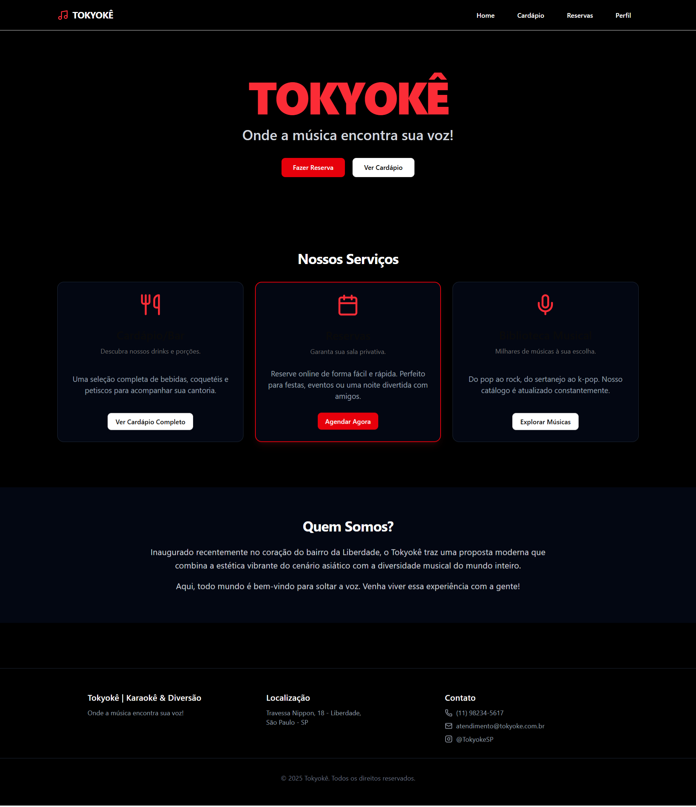
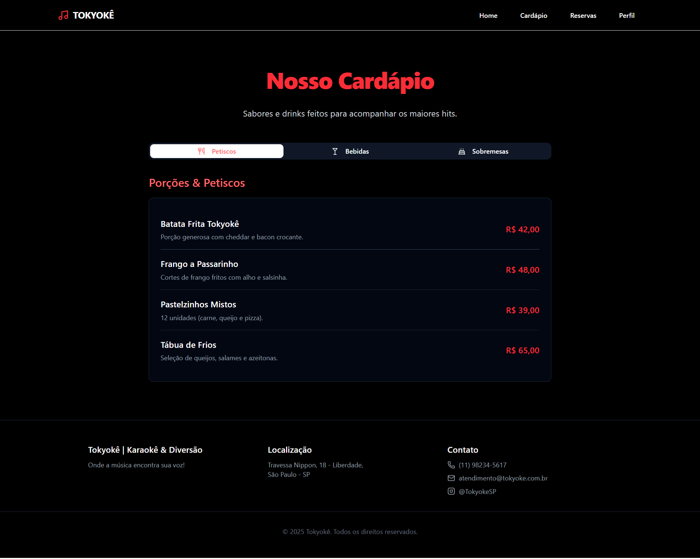
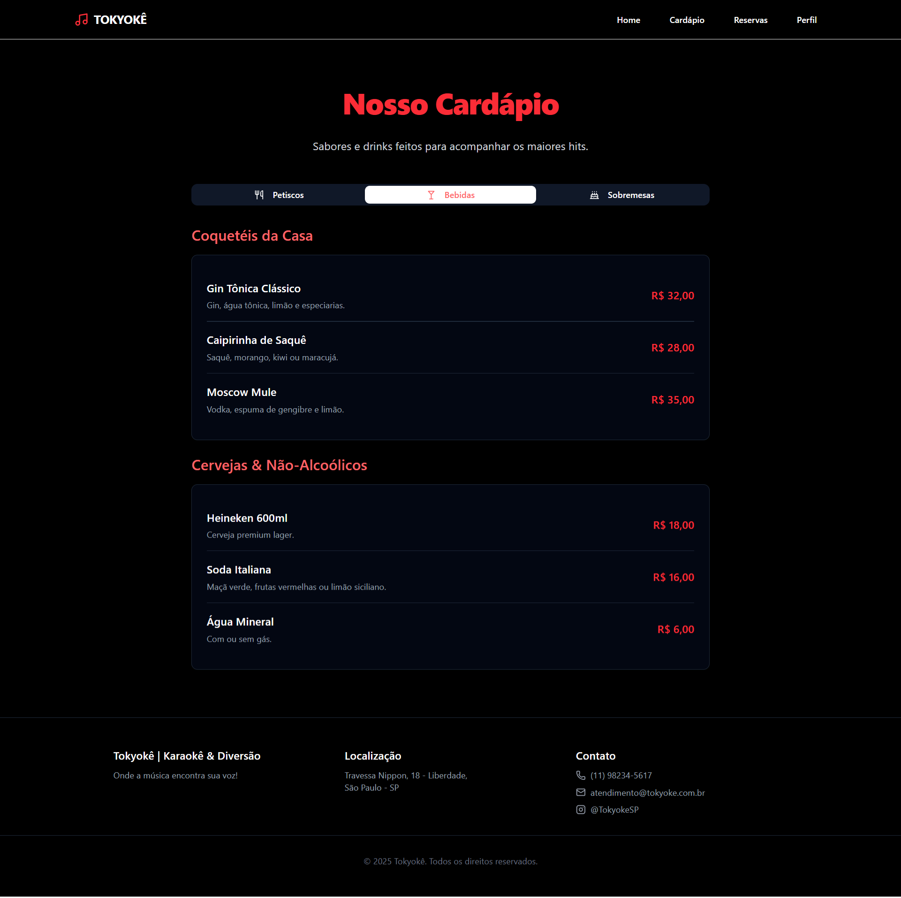
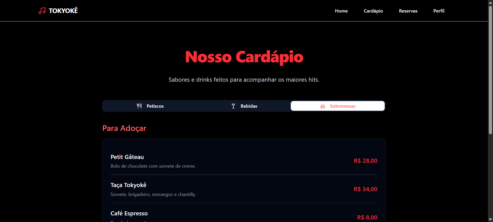
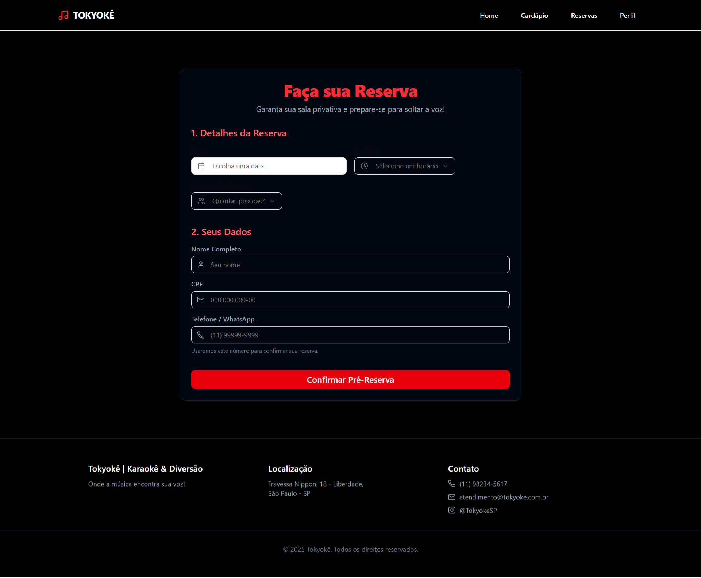
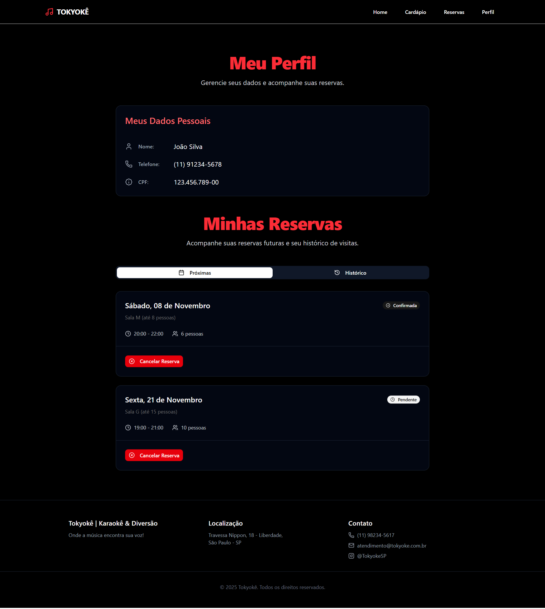
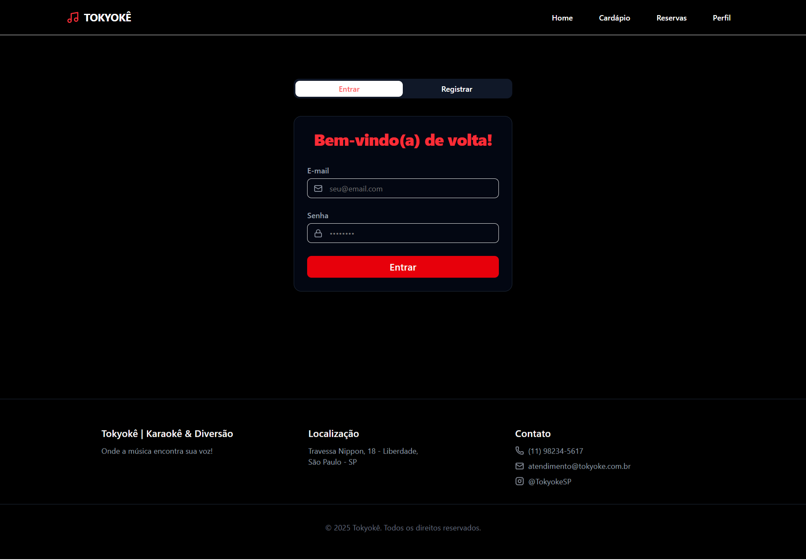
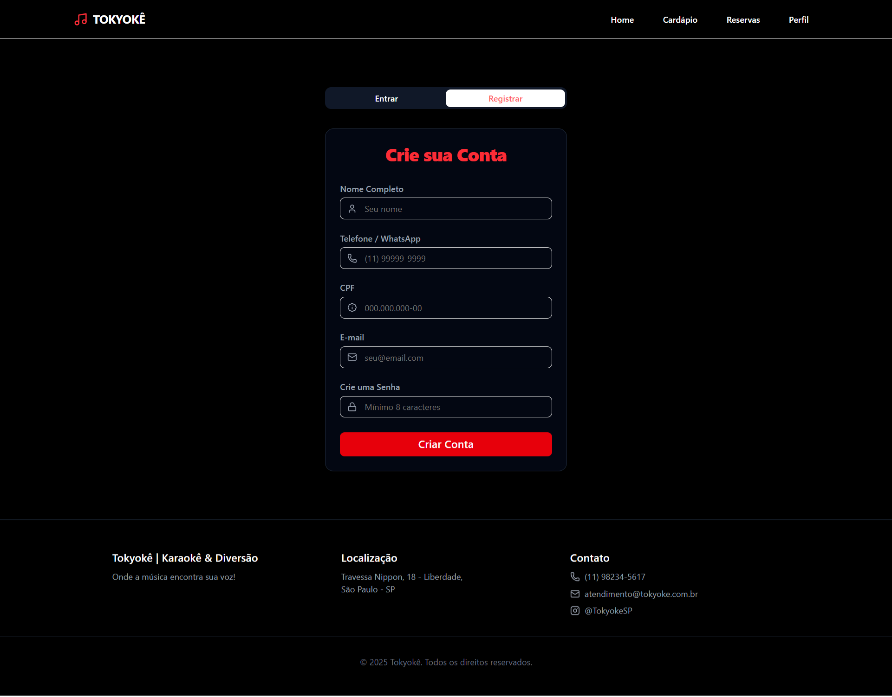

# Design das Páginas do Usuário

Este documento descreve o design estético e a funcionalidade das páginas acessíveis aos usuários finais do Tokyoke. O foco é na experiência do usuário, desde a navegação até a interação com os serviços oferecidos.

## Visão Geral do Design

As páginas do usuário mantêm a estética do tema escuro do painel administrativo, mas com um toque mais convidativo e focado na experiência de entretenimento. A paleta de cores e a tipografia são consistentes, garantindo uma identidade visual unificada. O design é responsivo e intuitivo, visando facilidade de uso para todos os visitantes.

### Paleta de Cores e Tipografia

*   **Fundo:** Principalmente preto (#000000), com seções de conteúdo em azul escuro quase preto (#1A1A2E) para distinção.
*   **Texto:** Branco (#FFFFFF) e cinza claro para o conteúdo principal, garantindo alta legibilidade.
*   **Elementos de Destaque:** O vermelho vibrante (#FF0000) é a cor de acentuação primária, utilizada para títulos importantes ("Nosso Cardápio", "Faça sua Reserva"), botões de ação ("Fazer Reserva", "Confirmar Pré-Reserva") e elementos interativos. O verde é usado para indicar status positivos (e.g., "Confirmada").
*   **Tipografia:** Uma fonte moderna e limpa é usada para todo o texto, mantendo a consistência e clareza. Títulos maiores utilizam uma variação da fonte que transmite energia e estilo, como visto no logo "TOKYOÊ" na página inicial.

### Estrutura e Layout

As páginas do usuário seguem um layout mais aberto e centralizado em comparação com o painel administrativo.

1.  **Barra de Navegação Superior (Navbar):** Fixada no topo da tela, contém o logo "Tokyoke" e links principais como "Home", "Cardápio", "Reservas" e "Perfil". Esta barra é consistente em todas as páginas, facilitando a navegação.
2.  **Área de Conteúdo Principal:** Variável de acordo com a página, apresentando os serviços, informações e formulários de forma clara e organizada.
3.  **Rodapé:** Consistente em todas as páginas, contendo informações de contato, localização e direitos autorais.

## Páginas Detalhadas

### 1. Página Inicial (Home)

A Home page é a porta de entrada para o Tokyoke, projetada para cativar o usuário e apresentar os principais serviços.

*   **Propósito:** Introduzir o Tokyoke, destacar seus serviços e incentivar a interação, como fazer uma reserva ou explorar o cardápio.
*   **Estética:** Design limpo com uma grande chamada "TOKYOÊ" em vermelho e um subtítulo convidativo. Três cartões de destaque, com ícones e breves descrições, representam os principais serviços (cardápio, reservas, músicas).
*   **Funcionalidade:** Botões de ação como "Fazer Reserva" e "Ver Cardápio" no topo da página e nos cartões de serviço direcionam o usuário para as respectivas seções. Uma seção "Quem Somos?" oferece uma breve introdução à proposta do Tokyoke.

### 2. Nosso Cardápio

A página do cardápio apresenta os itens disponíveis para consumo.

*   **Propósito:** Exibir de forma organizada todos os itens do cardápio, divididos por categoria, com descrições e preços claros.
*   **Estética:** Um grande título "Nosso Cardápio" em vermelho atrai a atenção. As categorias são navegáveis por abas com ícones ("Petiscos", "Bebidas", "Sobremesas"), que mudam de cor para indicar a seleção ativa. Os itens são listados em cartões escuros individuais, com nome, descrição e preço destacados em vermelho.
*   **Funcionalidade:** Permite ao usuário navegar facilmente entre as categorias de itens. A rolagem é suave para visualizar todos os itens dentro de uma categoria.

### 3. Faça sua Reserva

Esta página é dedicada ao processo de reserva de salas.

*   **Propósito:** Guiar o usuário através de um processo simples e intuitivo para fazer uma reserva, coletando as informações necessárias.
*   **Estética:** Centralizada em um formulário estruturado em duas etapas ("1. Detalhes da Reserva", "2. Seus Dados"). Campos de entrada com bordas sutis e ícones claros para cada tipo de informação. O botão "Confirmar Pré-Reserva" em vermelho é o destaque final.
*   **Funcionalidade:** Inclui seletores para data, horário e número de pessoas, além de campos para nome, CPF e contato. O layout em etapas facilita o preenchimento e a compreensão do usuário.

### 4. Meu Perfil

A página de perfil oferece ao usuário uma visão de seus dados e reservas.

*   **Propósito:** Permitir que o usuário visualize suas informações pessoais e gerencie (visualize, cancele) suas reservas futuras e passadas.
*   **Estética:** Divide-se em "Meus Dados Pessoais" e "Minhas Reservas". Os dados são apresentados de forma clara, com ícones para cada tipo de informação. As reservas são listadas em cartões individuais, com status visíveis (Confirmada em verde, Pendente em laranja) e um botão "Cancelar Reserva" em vermelho.
*   **Funcionalidade:** Permite ao usuário visualizar os detalhes de suas reservas. A navegação entre "Próximas" e "Histórico" (abas) organiza as reservas de forma lógica.

### 5. Entrar

A página de login para usuários existentes.

*   **Propósito:** Permitir que usuários registrados acessem suas contas.
*   **Estética:** Um modal centralizado com o título "Bem-vindo(a) de volta!" em vermelho. Campos de e-mail e senha são claros, com o botão "Entrar" em vermelho como o principal CTA. Há também abas "Entrar" e "Registrar" para alternar entre as ações.
*   **Funcionalidade:** Facilita o acesso rápido para usuários que já possuem conta.

### 6. Criar sua Conta

A página de registro para novos usuários.

*   **Propósito:** Coletar as informações necessárias para criar uma nova conta de usuário.
*   **Estética:** Similar à página de login, um modal centralizado com o título "Crie sua Conta" em vermelho. Múltiplos campos de entrada para informações como nome completo, telefone, CPF, e-mail e senha. O botão "Criar Conta" em vermelho é o destaque.
*   **Funcionalidade:** Fornece um formulário simples e direto para novos usuários se registrarem. Inclui dicas para criação de senha segura.

---

Este README visa fornecer uma documentação clara e concisa sobre o design e a funcionalidade das páginas do usuário do Tokyoke, destacando a coesão visual e a experiência de uso.